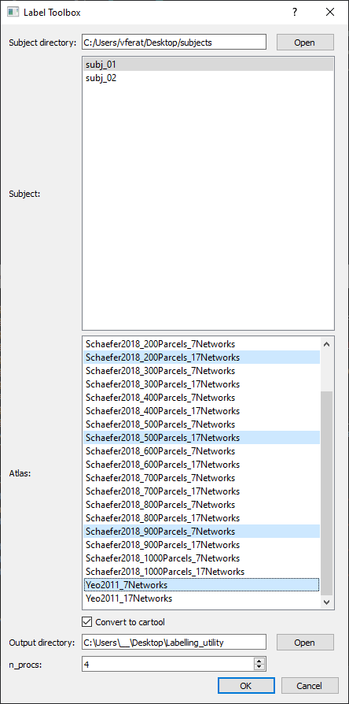

# Labelling Toolbox
Parallel processing toolbox designed to create individual brain atlases using FREESURFER. It relies on Nipype and Python multiprocessing library to parallelize jobs.



This could outpout files either to Nifti file format or convert it to analyze (uint8) file format. Last can be use as input into [Cartool](https://sites.google.com/site/cartoolcommunity/) to perform EEG source reconstruction
and Region of interest computation.

## Installation

The toolbox is written in python and therefore could be run in most common platforms. However, as processing relies on Freesurfer, the toolbox can only run on LINUX/OSX plateforms.
For WINDOWS users, you can consider using the Windows Subsystem for Linux.

### Installing FREESURFER
 This utility relies on [Freesurfer](https://surfer.nmr.mgh.harvard.edu/) to
 create individual brain atlases. To install and setup freesurfer, please refer to
 the [freesurfer wiki](https://surfer.nmr.mgh.harvard.edu/fswiki/DownloadAndInstall)

 ### Installing the labelling toolbox

 To install the toolbox, clone this repository:

 `git clone https://github.com/vferat/ParcEdit.git`

 Then go to the repository main folder and install dependencies:

 ```
 cd Labelling_utility
 pip install -r requirements.txt
 ```


## Run

To run the utility, simply go to the repository folder, open a terminal and type:

`python -m labelling.py`
